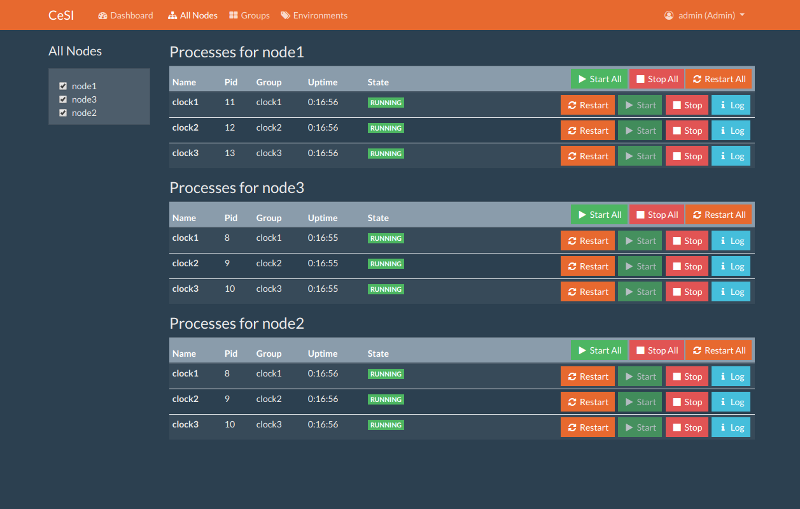

# CeSI (Centralized Supervisor Interface)

CeSI is a web interface for managing multiple [supervisors][1] from the same
place.

Supervisor has its own web UI but managing multiple supervisor installations is
hard with seperate UIs (If you are using the UI of course :). CeSI aims to solve
this problem by creating a centralized web UI, based on the RPC interface of
Supervisor.

## Installation

For running CeSI inside a docker container without installation see "Usage"
section.

**Prerequisites:**

- Python
- Flask
- sqlite3

You can install these dependencies on Ubuntu with:

    sudo apt-get install sqlite3 python python-flask

**Installation**

Then run these commands to install CeSI

    # Download the project
    git clone https://github.com/Gamegos/cesi

    # Or download and decompress the latest version at https://github.com/gamegos/cesi/releases
    # wget -qO- https://github.com/gamegos/cesi/archive/v2.0.0.tar.gz  | tar -xzf-

    cd cesi

    # Create user database
    sqlite3 path/to/userinfo.db < ../userinfo.sql

    # Create config file
    cp cesi.conf.sample cesi.conf

## Configuration

Update cesi.conf for your environment. Config file documentation can be found
inside sample file.

Then copy it under "/etc" folder

    cp cesi.conf /etc/cesi.conf

or create a symbolic link

    ln -s $PWD/cesi.conf /etc/cesi.conf

## Usage

Run

    python web.py

Or if you would like to run image, you must copy your config file in local pc in
/etc/ directory.

    docker run -d -p 5000:5000 -v /path/to/config/:/etc/ burcina/docker-cesi

### First Login

Please change password after first login!

- **Username:** admin
- **Password:** admin

## Blog

[Usage][2]

[1]: http://supervisord.org/
[2]: http://www.gulsahkose.com/2014/09/cesi-centralized-supervisor-interface.html

## TODO

- [ ] Fix user related api endpoints
- [ ] Fix node log view
- [ ] Refactor the usage of config
- [ ] Rewrite dockerfile and publish image on docker hub under gamegos
- [ ] Improve Docs
- [ ] Do not use external adresses for javascript and css libraries
- [ ] Use a logging lib
- [ ] Better format for activity logs (tabbed date, level, component, message)
- [ ] Auto refresh page
- [ ] Option to select different templates
- [ ] Upgrade flask
- [ ] Add tests
- [ ] CI integration
